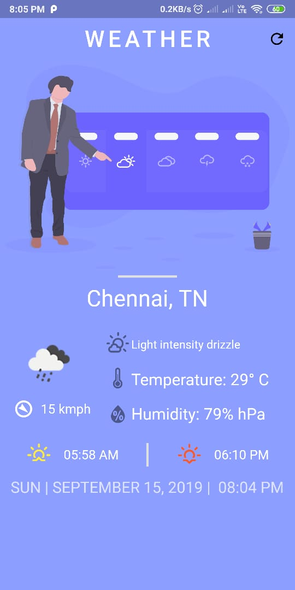
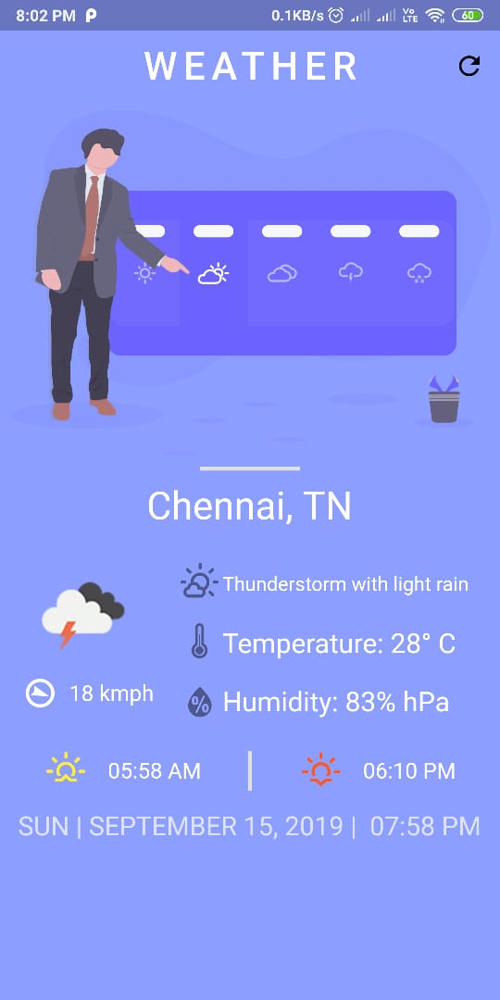

# Weather

A Simple Flutter based Application to understand how Provider can be used along with API calls asynchronously.

Currently the city is hardcoded, so it shows data for ```Chennai``` city only. If you want to try for your city, go to [Line 21](https://github.com/pratik037/Weather/blob/master/lib/app/model/weatherDataModel.dart) and change chennai to your city.

*Note: If your city is more than 2 words new york, just simply write it with spaces as shown below* ```api.openweathermap.org/data/2.5/weather?q=new york&APPID=c65cfd1d349d708a4c1fba7633d23bed&units=metric```

# Screenshots

  
